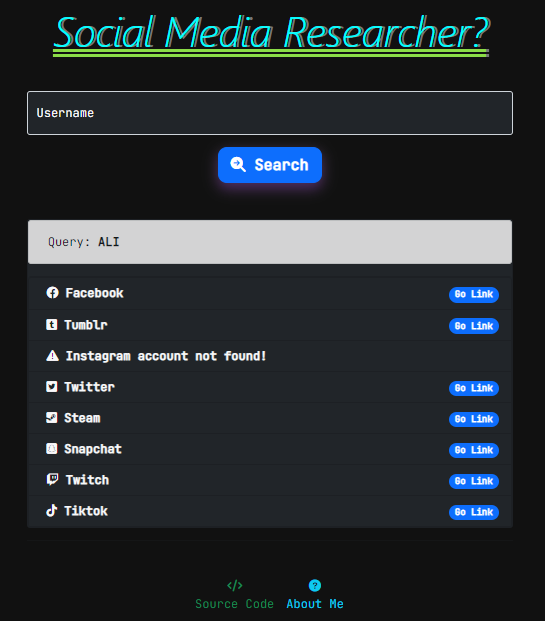

<h1 align='center'>Social Media Researcher</h1>
<a align='center'target="_blank" href="https://social-media-researcher.herokuapp.com/"></a>
<p align='center'>Basic Social Media Researcher website built in django web framework using Python.</p>
<p align='center' style="font-style: italic;">Not: It may not give precise results.</p>


<p align="center">
    <a href="https://social-media-researcher.herokuapp.com/">
        
    </a>
</p>

<p align='center'>
    
</p>


## Requirements
You can install the Requirements by running the command:

```
pip install -r requirements.txt
```

```
asgiref==3.5.0
certifi==2021.10.8
charset-normalizer==2.0.12
Django==3.2.12
idna==3.3
pytz==2022.1
requests==2.27.1
sqlparse==0.4.2
typing-extensions==4.1.1
urllib3==1.26.9
```

## Installation
```sh
$ git clone https://github.com/alii76tt/django-social-media-researcher
$ cd django-social-media-researcher
$ pip install -r requirements.txt
$ python manage.py runserver
```

## 3. Screenshots
<p align='center'>
    
    
</p>